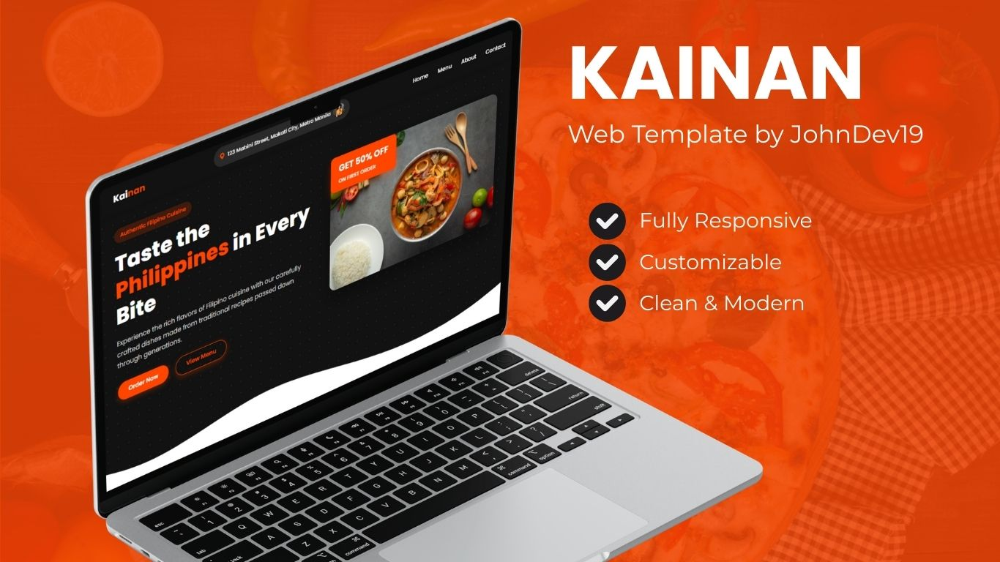
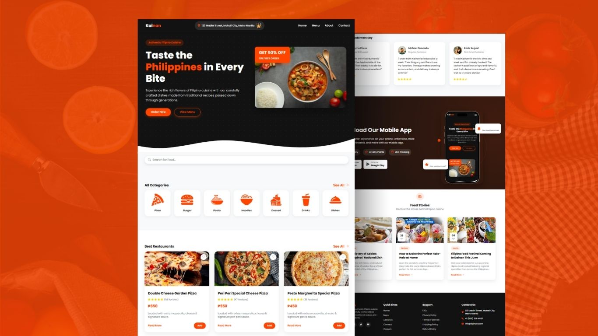

# Kainan - Authentic Filipino Cuisine Website

Kainan is a fully responsive and customizable website template designed for showcasing authentic Filipino cuisine...a modern design, user-friendly, and some sections to highlight the restaurant's offerings, including a menu, testimonials, and a blog.

## Features

- **Fully Responsive Design**: Adapts to all devices (desktops, tablets, and mobile phones).
- **Customizable Layout**: Easily modify styles and content to fit your brand.
- **Smooth Animations**: Custom animations.

## Contributing

Contributions are welcome! If you have suggestions for improvements or new features, please open an issue or submit a pull request.

## License

This project is licensed under the MIT License. See the [LICENSE](LICENSE) file for details.

## Contact

For any inquiries or feedback, please contact:

- **JohnDev19**: [iamjohndev19@gmail.com](mailto:iamjohndev19@gmail.com)
- **GitHub**: [JohnDev19](https://github.com/JohnDev19)

---
